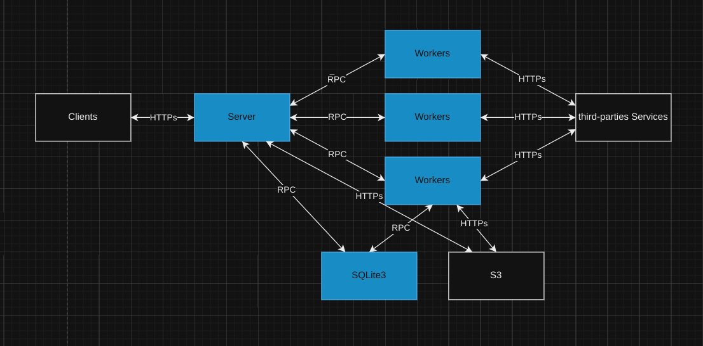
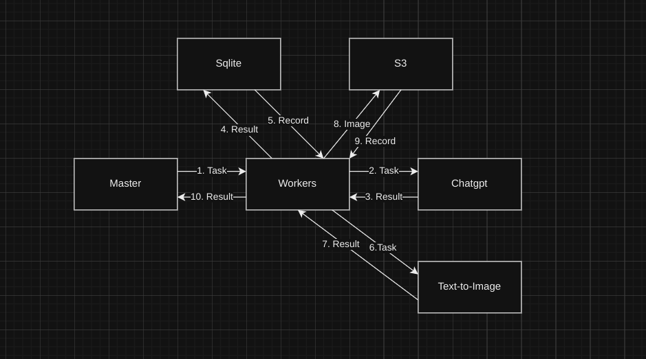
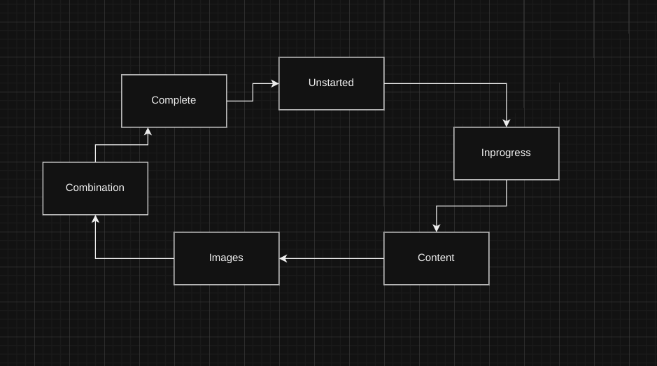

  <h1 align="center">AI Blog Generator</h1>
  
Ready to deploy, distributed AI services.

## 📖 Contents

- [Overview](#overview)
- [Features](#features)
- [Technologies](#technologies)
- [Getting Started](#getting-started)
- [Customization](#customization)
- [Usage](#usage)
  - [Mobile](#mobile)
- [Deployment](#deployment)
- [Contribute](#contribute)
- [License](#license)

## 🔍 Overview <a id="overview" />

A few months ago I got into the MIT 6.580 course. The concept of threading in go is fascinating. I came across a internship project with AIaas services before with python celery. However, it is complicated to use and start-off with less customization. Therefore I built this project to showcast my learning from the MIT course.

_It is important to note that this project is under active development and was developed as an experiment._

**Please leave a ⭐ as motivation if you liked the idea 😄**

## ✨ Features <a id="features" />

This system has lots of features such as:

- **Mobile UI**: A social media mobile application for reading the Blogs generated.

- **Robusted**: Distributed Design for running third-party servicies.

- **Ready to deploy**: Comes with docker files and compose for ready to deploy on Digital Ocean.

- **Easy to upgrade**: Modify the system easily to your needs.

## 🏭 Architecture <a id="architecture" />

It's a microservices based architecture with distributed task queue for decoupling. It utilised the gRPC library in golang for building customized databases connection and workers to boost IO operations with the third-party services, such as Mid-Journey, Chatgpt, Stable diffusion. Reminded that the workers acts as a state machine inside for complicated chained operations.

**Why event driven?**

Originally I made this using HTTP REST, but the workers like this are event driven by nature.

## 🍕 Getting Started <a id="getting-started" />

## 📄 License <a id="license" />

This project is MIT licensed, as found in the [LICENSE](./LICENSE)
